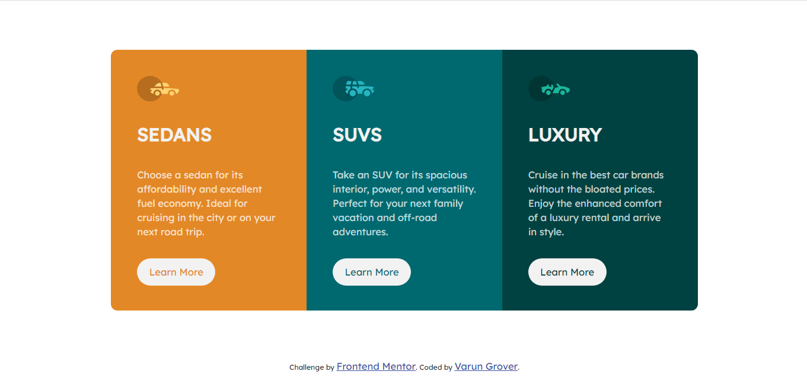

# Frontend Mentor - 3-column preview card component solution

This is a solution to the [3-column preview card component challenge on Frontend Mentor](https://www.frontendmentor.io/challenges/3column-preview-card-component-pH92eAR2-). Frontend Mentor challenges help you improve your coding skills by building realistic projects. 

## Table of contents

- [Overview](#overview)
  - [The challenge](#the-challenge)
  - [Screenshot](#screenshot)
  - [Links](#links)
  - [Built with](#built-with)
  - [Useful resources](#useful-resources)
- [Author](#author)

### The challenge

Users should be able to:

- View the optimal layout depending on their device's screen size
- See hover states for interactive elements

### Screenshot

### Links

- Solution URL: [Add solution URL here]()
- Live Site URL: [https://3-column-preview-card-component-frontend-mentor.netlify.app/](https://3-column-preview-card-component-frontend-mentor.netlify.app/)

### Built with

- Semantic HTML5 markup
- CSS custom properties
- Bootstrap
- Mobile-first workflow

### Useful resources

- [Bootstrap](https://getbootstrap.com/) - This helped me to create all the things in an easy way.

## Author

- Website - [Varun Grover](https://thevarungrovers.vercel.app/)
- Frontend Mentor - [@thevarungrovers](https://www.frontendmentor.io/profile/thevarungrovers)
- Twitter - [@thevarungrovers](https://www.twitter.com/thevarungrovers)
